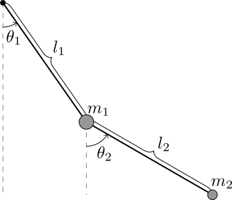

Learning about Lagrangian and Hamiltonian mechanics introduced me to an entirely new way of solving physics problems. The first time I'd read about this topic was in [The Principle of Least Action](http://www.feynmanlectures.caltech.edu/II_19.html) chapter in [Vol. 2 of The Feynman Lectures on Physics](http://www.feynmanlectures.caltech.edu/II_toc.html). I was introduced to a different perspective of viewing the physical world, perhaps a more general one than Newton's laws.

A famous example of a system whose equations of motion can be more easily attained using Lagrangian or Hamiltonian mechanics is the double pendulum. I saw a [Wolfram Science animation](http://scienceworld.wolfram.com/physics/DoublePendulum.html) of the system, but it didn't have the right `a e s t h e t i c` for me, and I wanted to write one of my own to investigate the system for various initial conditions and its chaotic behaviour.

The following shows the double pendulum system:

The Lagrangian of the system is:

$$ \mathcal{L} = T - V $$
$$ T = \frac{1}{2}m\_1 l\_1^2 \dot{\theta}\_1^2 + \frac{1}{2}m\_2\left[l\_1^2 \dot{\theta}\_1^2 + l\_2^2 \dot{\theta}\_2^2 + 2l\_1 l\_2 \dot{\theta}\_1 \dot{\theta}\_2 \cos(\theta\_1 - \theta\_2)\right]$$ 
$$ V = -(m\_1 + m\_2)gl\_1\cos \theta\_1 - m\_2gl\_2\cos\theta\_2 $$

After a [very long derivation](http://scienceworld.wolfram.com/physics/DoublePendulum.html), Hamilton's equations can be obtained:

$$ \dot{\theta\_1} = \frac{l\_2 p\_{\theta\_1} - l\_1 p\_{\theta\_2}\cos(\theta\_1 - \theta\_2)}{l\_1^2 l\_2[m\_1 + m\_2\sin^2(\theta\_1-\theta\_2)]} $$
$$ \dot{\theta\_2} = \frac{l\_1 (m\_1 + m\_2)p\_{\theta\_1} - l\_2 m\_2 p\_{\theta\_1}\cos(\theta\_1 - \theta\_2)}{l\_1^2 l\_2[m\_1 + m\_2\sin^2(\theta\_1-\theta\_2)]} $$
$$ \dot{p}\_{\theta\_1} = -(m\_1 + m\_2)gl\_1\sin\theta\_1 - C\_1 + C\_2$$
$$ \dot{p}\_{\theta\_2} = -m\_2gl\_2\sin\theta\_2 + C\_1 - C\_2$$
$$ C\_1 = \frac{p\_{\theta\_1}p\_{\theta\_2}\sin(\theta\_1-\theta\_2)}{l\_1 l\_2[m\_1 + m\_2\sin^2(\theta\_1-\theta\_2)]} $$
$$ C\_2 = \frac{l\_2^2 m\_2 p\_{\theta\_1}^2 + l\_1^2(m\_1 + m\_2)p\_{\theta\_2}^2 - l\_1 l\_2 m\_2 p\_{\theta\_1} p\_{\theta\_2} \cos(\theta\_1 - \theta\_2)}{2l\_1^2 l\_2^2[m\_1 + m\_2\sin^2(\theta\_1-\theta\_2)]^2}\sin[2(\theta\_1 - \theta\_2)] $$

These are very formidable-looking equations, and it is almost impossible to determine the particle trajectories by solving these equations analytically! So how does one solve it for practical purposes? Numerical methods and programming. I used Lua to program the simulator, including the [LÖVE](https://love2d.org) framework for the graphics.

Since the only data structure in Lua is a table, I decided to see how I could make use of that property for this program. Lua doesn't have functions to perform scalar multiplication or addition between tables, so I wrote some:
~~~lua
function directSum(a, b)
    local c = {}
    for i,v in pairs(a) do
        c[i] = a[i] + b[i]
    end
    return c
end

function scalarMultiply(scalar, table)
    local output = {}
    for i,v in pairs(table) do
        output[i] = scalar*table[i]
    end
    return output
end
~~~
So now I can store values, such as the initial conditions and parameters of the system in a table and perform basic arithmetic operations between tables to change values. Now to implement the physics of the problem. 

First, I defined a generator that randomly generates initial values (within a given range) of the masses of the bobs, the lengths of the rods, their angles with respect to the vertical, their initial angular velocities and calculated the momenta of the bobs. This is fed into a table called `data`:
~~~lua
function Generator()
    
    local self = {}
    
    self.m1 = love.math.random( 3, 10 )
    self.m2 = love.math.random( 3, 10 )
    self.l1 = love.math.random( 3, 10 )
    self.l2 = love.math.random( 1, 10 )
    self.t1 = love.math.random( -6.28, 6.28 )
    self.t2 = love.math.random( -6.28, 6.28 )
    self.o1 = love.math.random( -4, 4 )
    self.o2 = love.math.random( -2, 2 )
    self.p1 = (self.m1+self.m2)*(math.pow(self.l1, 2))*self.o1 
    + self.m2*self.l1*self.l2*self.o2*math.cos(self.t1-self.t2)
    self.p2 = self.m2*(math.pow(self.l2, 2))*self.o2 
    + self.m2*self.l1*self.l2*self.o1*math.cos(self.t1-self.t2)
    
    return self
end

data = Generator()
~~~
Now we set up the equations of motion using a function called `Hamiltonian`. It takes the initial values from `data` to perform calculations, and a new table called `phase` which consists of the phase space variables to update the angles and momenta over time:
~~~lua
function Hamiltonian(phase, data)

    local update = {}
    
    t1 = phase[1]
    t2 = phase[2]
    p1 = phase[3]
    p2 = phase[4]
    
    C0 = data.l1*data.l2*(data.m1+data.m2*math.pow(math.sin(t1-t2),2))
    C1 = (p1*p2*math.sin(t1-t2))/C0
    C2 = (data.m2*(math.pow(data.l2*p1,2))+(data.m1+data.m2)*
    (math.pow(data.l1*p2, 2))-2*data.l1*data.l2*data.m2*p1*p2*
    math.cos(t1-t2))*math.sin(2*(t1-t2))/(2*(math.pow(C0,2)))
    
    update[1] = (data.l2*p1 - data.l1*p2*math.cos(t1-t2)) / (data.l1*C0)
    update[2] = (data.l1*(data.m1+data.m2)*p2 - data.l2*data.m2*p1*
                math.cos(t1-t2)) / (data.l2*data.m2*C0)
    update[3] = -(data.m1 + data.m2)*g*data.l1*math.sin(t1) - C1 + C2
    update[4] = -data.m2*g*data.l2*math.sin(t2) + C1 - C2
    
    return update
end
~~~
All the required information with regard to the physics are now processed. To solve the differential equations, I implemented the Runge-Kutta method of order 4, performing operations on the tables using `directSum` and `scalarMultiply`. These operations take place in `Solver`, which takes the time input `dt` from LÖVE in `love.update()`.
~~~lua
function Solver(dt)

    local phase = {data.t1, data.t2, data.p1, data.p2}

    local k1 = Hamiltonian(phase, data)
    local k2 = Hamiltonian(directSum(phase, scalarMultiply(dt/2, k1)), data)
    local k3 = Hamiltonian(directSum(phase, scalarMultiply(dt/2, k2)), data)
    local k4 = Hamiltonian(directSum(phase, scalarMultiply(dt, k3)), data)
    
    local R = scalarMultiply(1/6 * dt, 	
    directSum(directSum(k1, scalarMultiply(2.0, k2)), 
    directSum(scalarMultiply(2.0, k3), k4)))
    
    data.t1 = data.t1 + R[1]
    data.t2 = data.t2 + R[2]
    data.p1 = data.p1 + R[3]
    data.p2 = data.p2 + R[4]
end

function love.update()
    Solver(dt)
end
~~~

After setting up the graphics end, I obtain nice animations like this:
<video width="100%" autoplay loop><source src="DubbyPendy.webm" type="video/webm">
  Your browser does not support the video tag.
</video>

I'll probably end up creating a new post with cool patterns emerging from this simulation, possibly checking for chaotic behaviour with initial conditions that are not so different from a previous state.