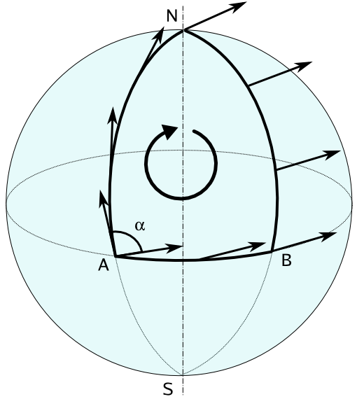

Bernard F. Schutz's [A First Course in General Relativity](http://www.cambridge.org/us/academic/subjects/physics/cosmology-relativity-and-gravitation/first-course-general-relativity-2nd-edition?format=HB&isbn=9780521887052) provides a nice introduction to the difficult subject in my opinion. In Chapter 6, he mentions that one should derive the Euler-Lagrange equations to minimise the spacetime interval of a particle's trajectory, obtaining the geodesic equation:

$$ \frac{\mathrm{d}}{\mathrm{d}\lambda}\left(\frac{\mathrm{d}x^{\gamma}}{\mathrm{d}\lambda}\right) + \Gamma^{\gamma}\_{~\alpha\beta}\frac{\mathrm{d}x^{\alpha}}{\mathrm{d}\lambda}\frac{\mathrm{d}x^{\beta}}{\mathrm{d}\lambda} = 0 $$

*Note:* At first I derived it from variational principles, but the Euler-Lagrange equations provide a faster route via means of a neat trick.

**Motivation**: The main aim of this investigation is to find curves that parallel-transport tangent vectors. The following diagram should make this idea clearer:

Image source: https://upload.wikimedia.org/wikipedia/commons/6/6d/Parallel_transport.png

If one starts from point A on the equator of a sphere and moves to the North pole, the tangent vector along the curve will look like the one shown in the figure, perpendicular to the equatorial line. Continuing this path from the North pole, if one wishes to reach a different point B on the equator, the vector field described will have undergone a 90 degrees rotation, so the vector points along the equatorial line.

This can be easily visualised as walking to the North pole from A with your arm outstretched forward (representing the tangent vector), which is perpendicular to the equator. Once you reach, you need to go to point B, so your body rotates, but your arm is fixed because of parallel transport, so you're now walking with your arm outstretched to the left. Once you reach point B, you realise that your arm is along the equatorial line. Therefore parallel transport isn't preserved because of the curvature of the sphere.

Since this is a property that directly results from the intrinsic curvature of the sphere, one can deduce that there is no definition of globally parallel vector fields. 

A geodesic can be thought of as a curve which parallel transports its own tangent vector. Another way of saying this is that it's the curve of shortest distance between two points in a given space of any curvature, implying local parallel transport. In the case of a sphere, a geodesic lies on a great circle, defined as the circle on the surface of a sphere which lies in a plane passing through the sphere's centre.

In relativity, the definition of distance (or interval between points) is a little different as compared to Euclidean geometry. Since we deal with space-time rather than space, the metric of space-time (called Minkowski space-time) must be used, as described below (in one convention):

$$ (\Delta s)^2 = -(c\Delta t)^2 + (\Delta x)^2 + (\Delta y)^2 + (\Delta z)^2 $$ 

There is a large historical development for this formulation with plenty of literature available. The foundation lies in Maxwell's equations and Einstein's postulates of special relativity. There is a more general formulation for calculating magnitudes over arbitrary metrics by using the dot product:

$$ \vec{U}\cdot\vec{V} = g\_{\alpha\beta}U^{\alpha}V^{\beta} = g\_{00}U^{0}V^{0} + g\_{10}U^{1}V^{0} + g\_{01}U^{0}V^{1} + ...$$

With summations over the set of values that the repeated indices $\alpha$ and $\beta$ take and $ g\_{\alpha\beta}(\vec x)$ is the metric tensor defined by the space under evaluation. In the case of special relativity, the metric tensor is represented as the matrix $ g\_{\alpha\beta} = \mathrm{diag}(-1,1,1,1) $ in one convention, a flat space-time.

The length of the tangent vector between two points can be described by its magnitude. This functional that must be minimised is called the proper length, and can be expressed as follows:

$$ \mathrm{d}s = \int\_{\lambda\_0}^{\lambda\_l} \left|\vec{V}\cdot\vec{V}\right|^{\frac{1}{2}} \mathrm{d}\lambda = \int_{\lambda\_0}^{\lambda\_1} \left|g\_{\alpha\beta}\frac{\mathrm{d}x^{\alpha}}{\mathrm{d}\lambda}\frac{\mathrm{d}x^{\beta}}{\mathrm{d}\lambda}\right|^{\frac{1}{2}} \mathrm{d}\lambda $$

Where $\lambda$ is a parameter for the curve, usually the proper time. This exercise essentially means that the magnitude of the four-velocity integrated over proper time should be a minimum. So the Lagrangian is:

$$ \mathcal{L} = \left|g\_{\alpha\beta}\frac{\mathrm{d}x^{\alpha}}{\mathrm{d}\lambda}\frac{\mathrm{d}x^{\beta}}{\mathrm{d}\lambda}\right|^{\frac{1}{2}} $$

The neat trick here is taking $\mathcal{L}^2$ and substituting it into the Euler-Lagrange equation:

$$ g\_{\alpha\beta,\mu}\dot{x}^{\alpha}\dot{x}^{\beta} - \frac{\mathrm{d}}{\mathrm{d}\lambda}\left[g\_{\alpha\mu}\dot{x}^{\alpha} + g\_{\mu\beta}\dot{x}^{\beta}\right] = 0 $$

Where $\dot{x} = \mathrm{d}x/\mathrm{d}\lambda$. Note that this equation just talks about extrema rather than maxima or minima explicitly. The second term is a total derivative, which results in:

$$ g\_{\alpha\beta,\mu}\dot{x}^{\alpha}\dot{x}^{\beta} - \left[g\_{\alpha\mu,\beta}\dot{x}^{\beta}\dot{x}^{\alpha} + g\_{\mu\beta,\alpha}\dot{x}^{\alpha}\dot{x}^{\beta} + g\_{\alpha\mu}\ddot{x}^{\alpha} + g\_{\mu\beta}\ddot{x}^{\beta} \right] = 0$$

Changing the last term's dummy index $\beta\rightarrow\alpha$ and multiplying by $g^{\mu\gamma}$:

$$ -2g^{\mu\gamma}g\_{\alpha\mu}\ddot{x}^{\alpha} + g^{\mu\gamma}\left(g\_{\alpha\beta,\mu} - g\_{\mu\beta,\alpha} - g\_{\mu\alpha,\beta}\right)\dot{x}^{\alpha}\dot{x}^{\beta} = 0 $$

Using the Christoffel symbol of the second kind with the following definition:

$$ \Gamma^{\gamma}\_{~\alpha\beta} = \frac{1}{2}g^{\mu\gamma}\left(g\_{\mu\beta,\alpha} + g\_{\mu\alpha,\beta} - g\_{\alpha\beta,\mu}\right)$$

and using $g^{\mu\gamma}g\_{\alpha\mu} = \delta^{\gamma}\_{~\alpha}$:

$$ -2\delta^{\gamma}\_{~\alpha}\ddot{x}^{\alpha} - 2\Gamma^{\gamma}\_{~\alpha\beta}\dot{x}^{\alpha}\dot{x}^{\beta} = 0 $$

The expression simplifies to the geodesic equation:

$$ \ddot{x}^{\gamma} + \Gamma^{\gamma}\_{~\alpha\beta}\dot{x}^{\alpha}\dot{x}^{\beta} = 0 $$

<!-- <iframe src="https://www.facebook.com/plugins/post.php?href=https%3A%2F%2Fwww.facebook.com%2FTheoreticalPhysicsMemes%2Fposts%2F1167606566653652%3A0&width=580"></iframe> -->