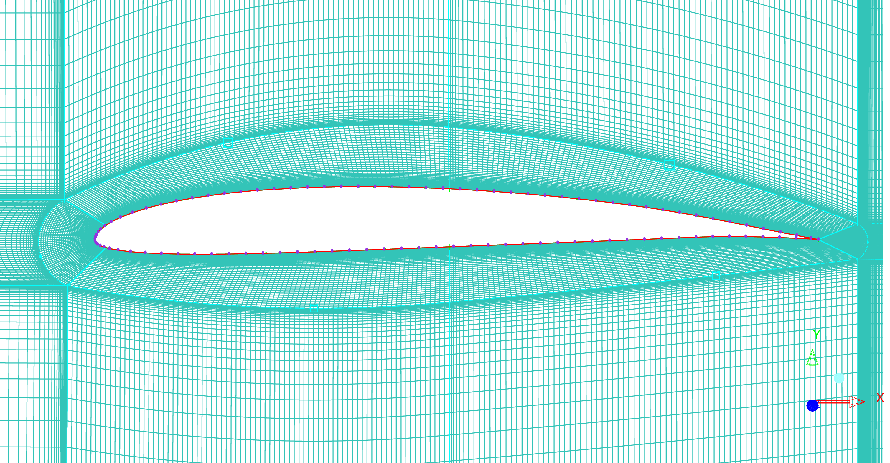

Meshing is a crucial process in obtaining accurate results for various simulations across different fields. In computational fluid dynamics, various meshing techniques are used in grid generation for 2D analyses of airfoils. Some nice run-throughs exist on YouTube, but they mostly deal with symmetric airfoils such as the *beloved* NACA 0012. I'll attempt generating preliminary meshes over a cambered airfoil in this post and probably write a project once I've been able to perform flow analyses with accurate results.

---

**Airfoil Selection:** A new airfoil I've been researching is the Selig S7075 for its good gliding/soaring characteristics and high efficiency at low Reynolds numbers. It's a cambered airfoil with sharp trailing edge, and a maximum thickness-to-chord ratio of 9%  with the implementation of a boundary layer trip at 57.5% of the chord length. XFOIL analyses predict accurate results in agreement with Dr. Selig's [A Summary of Low-Speed Airfoil Data, Vol. 3](http://m-selig.ae.illinois.edu/uiuc_lsat/Low-Speed-Airfoil-Data-V3.pdf).

---

**Meshing Software:** I'll be using ANSYS ICEM CFD and its convenient blocking features with its powerful sizing capabilities to generate 2D meshes. 
The two types of meshes I'll be trying to generate are an O-grid and a C-grid. An O-grid setup is when the body of analysis is enclosed within a curvilinear grid in which completely closed contours are created at offsets from the body. A C-grid setup, by example for an airfoil, is when the surrounding grid forms a 'C' till the trailing edge.  Forums recommend that a C-grid mesh provides better results for airfoils with sharp trailing edges; this is because the grid alignment is along the airfoil shape (hence along the flow streamlines) to capture the flow results more accurately.

The blocking process in ICEM CFD used the same aspect ratios for element sizing in both meshing techniques. The operating Reynolds number for the flow is $ Re = 310,000 $ at sea level conditions. The desired $ y^+ = 1.0 $ in accordance with the Spalart-Allmaras model, and the estimated wall distance $ = 2.0 \times 10^{-5}~ m $ to resolve the boundary layer.

---

>**C-Grid:**

---

>**O-Grid:**

---

**Bonus:** I was able to devise a blocking technique to generate a 3D C-grid about a rectangular wing with an SD6045 section as well.

 

 

---

These meshes will require refinement before they're ready to be analysed and produce accurate results, which I'll be working on as a project. Hopefully I'll be able to complete it soon and post it with all the details regarding the meshing procedure.

