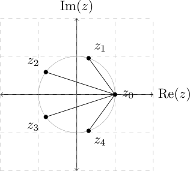

During my second year of the International Baccalaureate: Diploma Programme, we were assigned the task of making a portfolio for a problem statement in Mathematics HL. While I don't have the problem statement anymore, I'll outline the major points of the task:

* Find the solutions to $z^n - 1 = 0,~ z \in \mathbb{C}$.
* Plot these solutions on the Argand plane.

* Draw a tree diagram starting from the trivial solution $z = 1$ to every other root.
* Investigate the exercise, devise a conjecture and prove it.
  
When I first read through this exercise, I didn't really expect anything interesting to show up. Well, I was horribly wrong; something really cool showed up which made me learn about a lot of little things in complex analysis as a result. I'll start by solving the above points sequentially -- 

+ The solutions to $z^n - 1 = 0$ are obtained most easily through Euler's form:
    $$ z\_k = \exp\left(\frac{2k\pi i}{n}\right),~~k = 0,...,n-1 $$

+ As they are the roots of unity, they appear as points on the unit circle in the Argand plane. For example, $z^5 - 1 = 0$ has the following solutions and tree diagram:

+ The easiest observation is that the sum of the roots is zero:
    $$ \sum^{n-1}\_{k = 0} z_k = 0 $$ 
    
+ The roots of unity can be factorised into the following irreducible form over the field of real numbers:
    $$ z^n - 1 = (z-1)\sum^{n-1}\_{i = 0} z^i $$ 
    and can be factorised over the complex field as:
    $$ z^n - 1 = \prod\_{k=0}^{n-1}(z-z\_k) = (z-1)\prod\_{k=1}^{n-1}(z-z\_k) $$
    
+ A conjecture based on trial and error is:
    $$ \prod\_{k=1}^{n-1}|z\_k - z\_0| = \prod\_{k=1}^{n-1}|1-z\_k| = n$$ 
    This states that the product of the distances between each root from a selected root is equal to the number of roots. To prove this, notice that:
    $$\sum^{n-1}\_{i = 0} z^i = \prod\_{k=1}^{n-1}(z-z\_k) = \frac{z^n - 1}{z-1}$$ 
    For the equalities to be sensible at $z=1$, one must perform analytic continuation: 
    $$\sum^{n-1}\_{i = 0} 1^i = \prod\_{k=1}^{n-1}|1-z\_k| = \lim\_{z\rightarrow 1} \frac{z^n - 1}{z-1}$$
    The first equality proves the conjecture. The last equality is evaluated using L'Hôpital's rule, also  proving the conjecture:
    $$ \lim\_{z\rightarrow 1} \frac{z^n - 1}{z-1} = \lim\_{z\rightarrow 1} nz^{n-1} = n $$