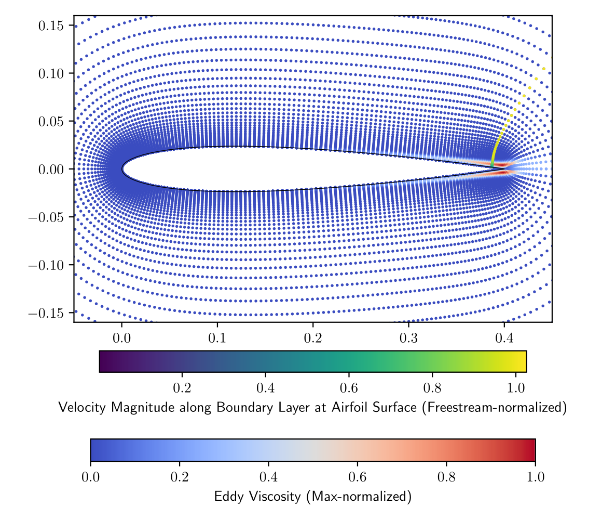
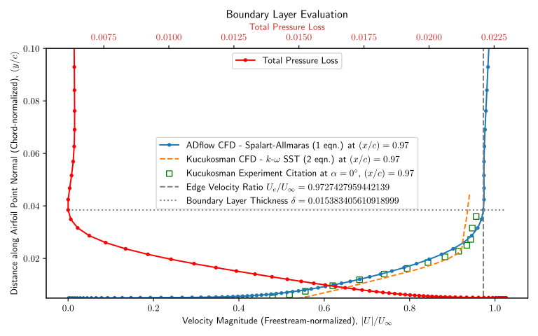
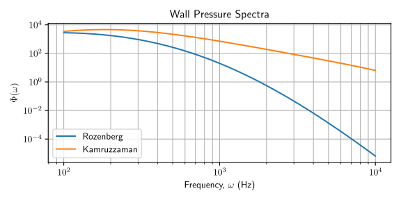

**Shape optimization of airfoils with multi-fidelity CFD and noise prediction models.**

* Implemented *differentiable* boundary layer data extraction from the CFD solvers ADflow and CMPLXFOIL.
* Developed components of semi-empirical noise models for constructing coupled analyses with [MPhys](https://openmdao.org).
* Currently researching *multi-objective gradient-based* constrained optimization.

Boundary layer quantities are extracted differentiably from the flow field, validated against reference CFD and experiment, then fed into semi-empirical wall-pressure-spectrum models that predict trailing-edge noise.

### Related publications

* Yuan Lyu, Arjit Seth, and Rhea P. Liem. "Fuel consumption and trailing-edge noise tradeoff studies via mission-based airfoil shape optimization". *Aerospace Science and Technology* 151 (2024), p. 109331. [doi:10.1016/j.ast.2024.109331](https://doi.org/10.1016/j.ast.2024.109331)
* Stéphane Redonnet, Turzo Bose, Arjit Seth, and Larry K. B. Li. "Airfoil Self-Noise Prediction Using Deep Neural Networks". *Engineering Analysis with Boundary Elements* 159 (2024), pp. 180–191. [doi:10.1016/j.enganabound.2023.11.024](https://doi.org/10.1016/j.enganabound.2023.11.024)
* Dajung Kim, Arjit Seth, and Rhea P. Liem. "Geometric Programming for Airfoil Shape Optimization With Geometric Constraints". *AIAA SCITECH 2025 Forum*. [doi:10.2514/6.2025-0653](https://doi.org/10.2514/6.2025-0653)
