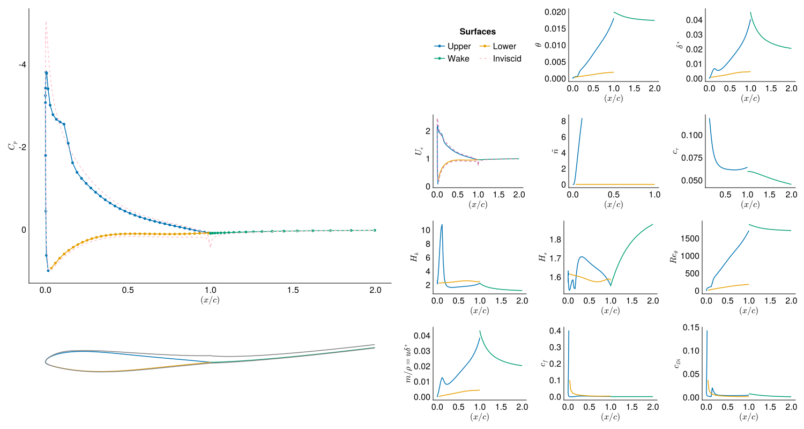
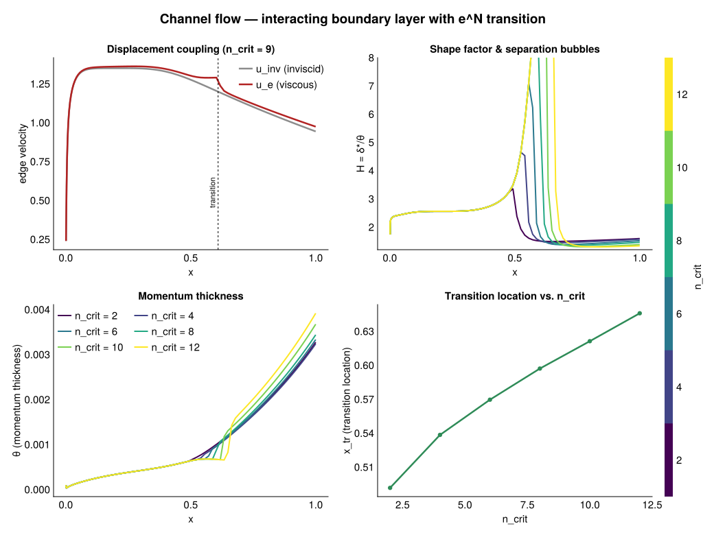

**Viscous-inviscid interacting (VII) boundary layer methods for aerodynamic analyses.**

* Implemented a *modular*, strongly-coupled VII integral boundary layer method.
* Incorporated *automatic differentiation* for generalizations to coupled analyses (e.g. aero-structural).
* Researching generic optimization capabilities within various MDO architectures (MDF, SAND).

The solver strongly couples an inviscid panel solution with the integral boundary layer equations over the upper surface, lower surface, and wake, in a single differentiable system, implemented in [ViscFoil.jl](https://github.com/GodotMisogi/ViscFoil.jl) (currently private).

<!-- The formulation is developed in detail below. -->

---

#### References

1. Drela, Mark. _Flight Vehicle Aerodynamics_. The MIT Press, 2014.
2. Drela, Mark and Giles, M. B. _Viscous-Inviscid Analysis of Transonic and Low Reynolds Number Airfoils_. AIAA Journal, 1986.
3. Katz, Joseph and Plotkin, Allen. _Low-Speed Aerodynamics - 2nd Edition._ Cambridge University Press, 2001.
<!-- 
# Viscous-Inviscid Panel Methods

Boundary element methods express the solution of some PDE on a volume by reducing it to the specification on a surface. Panel methods in aerodynamics are special cases of such expressions, in which the governing equation is Laplace's equation in a uniform flow in the case of a steady, inviscid, incompressible fluid.

## Equivalent Inviscid Flow

### Governing Equations

The governing equation for this problem is Laplace's equation in 2 dimensions:
$$ \nabla^2 \phi = \nabla^2\left(\Phi + \Phi_\infty\right) = 0 $$

Note that the Laplace equation is an elliptic PDE, hence boundary conditions specified at any point in the domain affect the solution at all other points in the domain.

The "physically" motivated formulation for a closed, non-porous foil is the specification of Neumann boundary conditions, which state that the normal velocity through the foil is zero and the velocity vanishes at infinity:

$$\nabla \Phi^* \cdot \hat{\mathbf n} = \nabla (\Phi + \Phi_\infty) \cdot \hat{\mathbf n} = 0, \quad \lim_{n \to \infty} \nabla \Phi = \mathbf 0$$

This implies that the potential of the interior of the body is equal to some constant $c$:

$$ \Phi_\text{int}^* = (\Phi + \Phi_\infty) = c$$

The above condition is an alternative specification in the form of a Dirichlet boundary condition on the surface boundary $\partial S$, and turns out to be more computationally efficient as the operations are on scalars rather than vectors.

### Solution

Using Green's third identity, the solution on $\partial S$ is expressed in terms of sources $\sigma$ and doublets $\phi$ of varying strength in streamwise-normal ($\hat{\mathbf s}, \hat{\mathbf n}$) coordinates: 

$$ \Phi^{\*}\_{\text{int}}(x,y) = \Phi_{\infty}(x,y) + \frac{1}{2\pi}\int_{\partial S} \left[\sigma \ln r - \phi \frac{\partial\ln r}{\partial n}\right]\ dS, \quad \sigma = \frac{\partial\phi}{\partial n} $$

*Note*: Vortices are streamwise derivatives of doublets:

$$ \vec\gamma(s) = \hat{\mathbf n} \times \hat{\mathbf s}\frac{d\phi}{ds} $$ -->

<!-- ### Discretisation

Discretise the equation for a foil, in which $N$ panels are assigned to the foil, and $N_w$ panels are assigned to the wake.

Assign each panel on the foil a constant doublet strength $\phi$, and assign all panels constant source strengths $\sigma$, giving the following:

$$ \Phi_{\infty}(x,y) + \sum_{j = 1}^N \left(\frac{\sigma}{\pi}\int_{\text{panel}}\ln r \ dS\right)_j - \sum_{j = 1}^N \left(\frac{\phi}{\pi}\int_{\text{panel}}\frac{\partial\ln r}{\partial n} \ dS\right)_j = \phi_p(x,y) $$

Let: 
$$ B_j \equiv \frac{1}{\pi}\int_{\text{panel}}\ln r \ dS\bigg|_j, \quad A_j \equiv -\frac{1}{\pi}\int_{\text{panel}}\frac{\partial\ln r}{\partial n} \ dS\bigg|_j$$

For foil panels, we get the following system of equations:

$$ A \phi + \vec\Phi^{\*} = \vec\Phi_{\infty} - B\sigma $$

Let $\vec U_s = \\{~\vec U \cdot ~\hat s_i \mid 1 \leq i \leq N + N_w ~\\}$.  -->

<!-- ### Kutta Condition

The Kutta condition ensures the flow leaves the trailing edge "smoothly":

$$ \Delta \phi_W = \phi_N - \phi_1 $$

The Morino condition, which equates the potential difference at the upper and lower streamlines of the trailing edge, sometimes appears to be more accurate:

$$ \phi_1 - \phi_2 = \phi_N - \phi_{N-1} $$ -->

<!-- ### Cases

Now we deal with two cases:

1. Let $\Phi_{\infty}(x,y) = \Phi^{\*}\_\text{int}(x,y)$. This system is directly invertible for $\phi_j$ when $\sigma_j$ is specified as $\sigma_j = \vec U_\infty \cdot \hat n_j$.

$$ \vec\phi = (-A^{-1}B)\vec\sigma \equiv P\vec\sigma$$

2. Let $\sigma_j = \Phi^{\*}\_\text{int} = 0$, then the system is also directly invertible for $\vec\phi$ at a lower cost:

$$ \vec\phi = A^{-1} \vec\Phi_{\infty}(x,y)$$ -->

<!-- ## Real Viscous Flow

### Doublet Expressions

For viscous modelling, we deal with the first case using the wall transpiration model on the EIF. First, we express the edge velocities over the panels, which are the tangential derivatives of the exterior potential, expressed as the sum of the internal potential and the potential 'jump' across the singularity distribution: $\Phi^{\*}\_\text{ext} = \Phi^{\*}\_\text{int} - \phi$. In case 1: $\Phi^{\*}\_\text{int} = c \in \mathbb R$, and $\phi = \Phi_{\infty} +???$. -->

<!-- OUTLINE (author to write): kill the "+???" placeholder above. In case 1 the interior
     potential is held at the constant c, and the exterior (physical) potential is the interior
     minus the doublet jump:  Φ*_ext = Φ*_int − φ = c − φ. Solving the surface equation gives the
     doublet distribution φ in terms of the known freestream + source contribution; write φ
     explicitly as  φ = Φ_∞ + (the source/geometry term B·σ carried through case 1, i.e. −P·σ
     from the earlier  φ = (−A⁻¹B) σ ≡ P σ  relation). State the finished expression and delete
     the "+???". One clean line replacing the placeholder; the matrix form is already below.
     (Rendered math: keep the \_ subscript escaping used throughout this post.)
     Concrete code (ViscFoil.jl): src/inviscid.jl — solve_inviscid, defect_block,
     source_mass_block!, edge_velocity_source_derivative build exactly this P σ / edge-velocity map.
-->

<!-- $$ 
\begin{aligned} 
   \vec u_e = 
   \begin{cases} 
      \vec U_s^f - \dfrac{d\phi}{ds} & \text{Airfoil} \\\\ 
      & \\\\ 
      \vec U_s^w - \dfrac{d}{ds}\left(A^w \phi + B^w \sigma \right) & \text{Wake} 
   \end{cases} 
\end{aligned} 
$$

Substituting the solution for $\phi$ from case 1, we obtain the following matrix expression:

$$
\begin{aligned}
    \vec u_e & = \vec U_s - \frac{d}{ds} 
    \begin{bmatrix} P \\\\ 
          \hline A^w P + B^w
    \end{bmatrix} 
    \vec\sigma
\end{aligned}
$$

Now express the sources in terms of the mass defect $m = u_e\delta^*$: 

$$
\begin{aligned}
\sigma_j & = \left(\frac{dm}{ds}\right)_j \\\\ 
\vec u_e & = \vec U_s - \frac{d}{ds}
    \begin{bmatrix}
        P \\\\ 
        \hline A^wP + B 
    \end{bmatrix}
    \frac{d\vec m}{ds}
\end{aligned}
$$

This gives a differential equation for $\vec u_e$. -->

<!-- ### Difference Operators

Define the following operator $\Delta^+\colon \mathbb R^n \to \mathbb R^{n-1}, n \in \mathbb N^+$ to evaluate forward differences with matrix representation:

$$ 
\Delta^+ \equiv 
\begin{bmatrix} 
-1 \& 1 \& 0 \& \ldots \& 0 \\\\ 
0 \& -1 \& 1 \& \ldots \& 0 \\\\ 
\vdots \& \ddots \& \ddots \& \ddots \& \vdots \\\\ 
0 \& \ldots \& -1 \& 1 \& 0 \\\\ 
0 \& \ldots \& 0 \& -1 \& 1 
\end{bmatrix} 
$$

Difference operators can be used to generically compute $n$th order differences up to desired accuracy.

The following operator $\Delta^C\colon \mathbb R^n \to \mathbb R^n$ constructs central differences with forward and backward differencing at the endpoints:

$$
\Delta^c \equiv
\begin{bmatrix}
  -1 & 1 & 0 & \ldots & 0 \\\\ 
  -1/2 & 0 & 1/2 & \ldots & 0 \\\\ 
  \vdots & \ddots & \ddots & \ddots & \vdots \\\\ 
  0 & \ldots & -1/2 & 0 & 1/2 \\\\ 
  0 & \ldots & 0 & -1 & 1
\end{bmatrix}
$$ -->
<!-- 
## Boundary Layer Equations

The thin shear boundary layer equations are obtained via the defect formulation and the thin shear approximations of the Navier-Stokes equations.

$$ 
\begin{aligned} 
   \frac{d\theta}{ds} + (H + 2 - M_e^2)\frac{1}{u_e}\frac{du_e}{ds} - \frac{c_f}{2} & = 0 \quad (\textsf{Momentum}) \\\\ 
   \frac{1}{\theta^\*}\frac{d\theta^\*}{ds} + \left(\frac{2H^{\*\*}}{H^\*} + 3 - M_e^2\right)\frac{1}{u_e}\frac{du_e}{ds} - 2c_\mathcal{D} & = 0 \quad (\textsf{Kinetic Energy})
\end{aligned}
$$

where $H\equiv \delta^\*/\theta$ is the momentum shape parameter, $c_f \equiv \tau_w/\frac{1}{2}\rho_e u_e^2$ is the shear stress coefficient normalised with respect to the freestream edge velocity, $M_e \equiv u_e/a_e$ is the local Mach number at the edge, $H^\* \equiv \theta^\*/\theta$ is the kinetic energy shape parameter, $H^{\*\*} \equiv \delta^{\*\*}/\theta$ is the density shape parameter, $c_\mathcal D \equiv \mathcal D / \rho_e u_e^3$ is the power dissipation coefficient.

$\textsf{Kinetic Energy} - H^\*(\textsf{Momentum})$ gives the kinetic energy shape parameter equation:

$$
\begin{aligned}
 \implies \theta\frac{dH^\*}{ds} + \left[2H^{\*\*} + H^\*(1 - H)\right]\frac{\theta}{u_e}\frac{du_e}{ds} - 2c_\mathcal{D} + H^\*\frac{c_f}{2} & = 0
\end{aligned}
$$ -->

<!-- ### Closure Relations

The following functional dependencies are used to close the system:

$$
\begin{aligned}
    H^* & = H^*(H) \\\\ 
    C_f & = C_f(H, Re_\theta) \\\\ 
    C_\mathcal D & = C_\mathcal D(H, Re_\theta)
\end{aligned}
$$

where $H_k$ is the kinematic shape parameter, derived by Whitfield as:

$$ H_k = \frac{H - 0.290M_e^2}{1 + 0.113M_e^2} $$ -->

<!-- #### Laminar Closure

Falkner-Skan: -->

<!-- OUTLINE (author to write): the laminar closure set (currently just the words "Falkner-Skan:").
     Give H*, Cf·Reθ and 2CD/H* as explicit functions of the kinematic shape parameter H_k, from
     the Falkner–Skan family fits used by Drela & Giles (1986) — already reference [2]. Structure:

  - Kinetic-energy shape parameter:  H* = H*(H_k)  — two-branch rational fit (H_k < 4 vs ≥ 4).
  - Skin friction:  (Re_θ) Cf/2 = f(H_k)          — piecewise fit, sign change past separation.
  - Dissipation:    2 CD / H* = g(H_k)             — energy-equation closure.
  Write the actual correlation formulas (with their coefficients) from the paper, and note each
  is a curve fit to the Falkner–Skan similarity solutions — connect back to the Falkner–Skan
  section in the nonlinear-dynamics post. State the validity range and the separation value of H_k.
  (Rendered math: \_ subscript escaping.)
  Concrete code (ViscFoil.jl): src/closure_relations.jl — laminar_kinetic_energy_shape_parameter,
  laminar_skin_friction_coefficient, laminar_dissipation_coefficient (+ wake variants). CONTEXT.md
  "Closure Relations" defines every symbol (Hk, Hs, cf, cDi, Reθ, cτ).
-->

<!-- #### Turbulent Closure

### Turbulent Magic

$$ \frac{\delta}{C_\tau} \frac{dC_\tau}{ds} = 4.2\left(\sqrt{C_{\tau_{EQ}}} - \sqrt{C_\tau}\right) $$ -->

<!-- OUTLINE (author to write): finish the turbulent closure + name the transition model. The
     equation above is the shear-lag (lag-entrainment) ODE for the shear-stress coefficient Cτ —
     explain what it is, don't leave it bare. Structure:

  Turbulent closure (Drela & Giles 1986 / Swafford correlations):
  - Skin friction Cf(H_k, Re_θ, M_e): give the compressible turbulent Cf fit.
  - H* = H*(H_k, Re_θ): kinetic-energy shape-parameter fit (turbulent branch).
  - Dissipation CD split into wall + wake parts; CD = Cf/2 · U_s + Cτ (1 − U_s), tie to Cτ below.
  - The "Turbulent Magic" ODE: this is a NON-equilibrium closure — Cτ relaxes toward its local
    equilibrium value C_{τ,EQ} over a lag length ∝ δ. Give C_{τ,EQ}(H_k) and the constant 4.2
    (Drela's value), and one sentence on WHY a lag equation (history effects the algebraic
    closures miss). This is the "magic" — say what it buys.

  Transition (the e^n / amplification model, already used in the residual eqns as dñ/dRe_θ):
  - Envelope e^n method: integrate the amplitude ratio ñ; transition trips where ñ = n_crit
    (n_crit ≈ 9 for smooth/low-turbulence, tie to ambient turbulence level).
  - Give the dñ/dRe_θ(H_k) and dRe_θ/ds correlations that close R_{3,i}. State one clean sentence
    on how transition switches the closures from the laminar set to the turbulent set.
  (Rendered math: \_ subscript escaping.)
  Concrete code (ViscFoil.jl): turbulent closure in src/closure_relations.jl
  (turbulent_skin_friction_coefficient, turbulent_dissipation_coefficient,
  equilibrium_shear_stress_coefficient, shear_stress_coefficient); transition in src/transition.jl
  (amplification_rate, march_amplification, update_transition). CONTEXT.md "Transition" documents
  the ñ_crit trip and the station-marching. The Turbulent2D/Laminar2D switch is in
  src/boundary_layer_types.jl.
-->

<!-- ### Discretisation

The equations are discretised using central differencing, in which the variables are defined on the panel nodes. 

**Note**: Each singularity from the inviscid formulation is at the midpoint of each panel. The edge velocities from these computations are at the nodes, hence $N$ panels with $N+1$ edge velocities.

$$ \Delta x = \frac{x_{i+1} - x_{i-1}}{2}, ~x_a = \frac{x_{i+1} + x_{i-1}}{2} $$

Resulting in the following discrete BL equations:

$$
\begin{aligned}
    \frac{\Delta\theta}{\Delta s} + \left(\frac{\delta_a^*}{\theta_a} + 2 - M_e^2\right)\frac{1}{u_{e_a}}\frac{\Delta u_e}{\Delta s} - \frac{c_{f_a}}{2} & = 0 \\\\ 
    \frac{\Delta H^*}{\Delta s} + H_a^*(1 - H_a)\frac{\theta_a}{u_{e_a}}\frac{\Delta u_e}{\Delta s} - 2c_{\mathcal{D}_a} + H_a^*\frac{c_{f_a}}{2} & = 0
\end{aligned}
$$

## Residual Equations

$$\begin{aligned}
    \nabla^2 \phi & = 0, \quad \rho_e \mathbf u_e \cdot \mathbf n = \Lambda\\\\ 
    \frac{d\theta}{ds} + (H + 2 - M_e^2)\frac{1}{u_e}\frac{du_e}{ds} - \frac{c_f}{2} & = 0 \\\\ 
       \frac{1}{\theta^\*}\frac{d\theta^\*}{ds} + \left(\frac{2H^{\*\*}}{H^\*} + 3 - M_e^2\right)\frac{1}{u_e}\frac{du_e}{ds} - 2c_\mathcal{D} & = 0
\end{aligned}$$

### Discretisation

The discretised inviscid and viscous equations form the following system of equations to be solved for $m,~\theta,~\tilde n$.

$$\begin{aligned} 
    \mathbf u_e - \mathbf U_s + \frac{d}{ds}
    \begin{bmatrix} 
        P \\\\ 
        \hline A^wP + B 
    \end{bmatrix} \frac{\Delta (\mathbf u_e \boldsymbol\delta^*)}{\Delta s} & = \mathcal R_1(\mathbf m) \\\\ 
    \frac{\Delta\theta}{\theta} + \left(H + 2\right)\frac{\Delta u_e}{u_{e_a}} - \frac{c_{f_a}\Delta s}{2} & = \mathcal R_2(\mathbf m, \boldsymbol \theta, \tilde{\mathbf n}) \\\\ 
    \frac{\Delta H^*}{H^*_a} + \left(1 - H\right)\frac{\Delta u_e}{u_{e}} + \left(\frac{c_{f}}{2} - \frac{2C_{\mathcal D}}{H^*} \right) \frac{\Delta s}{\theta} & = \mathcal R_3(\mathbf m, \boldsymbol \theta, \tilde{\mathbf n})
\end{aligned}$$

The previous setup is sufficient for modelling flows with laminar boundary layers. The additional equations for modelling transition and turbulence are:

$$\begin{aligned}
    \frac{\Delta \tilde n}{\Delta s} - \frac{d\tilde n}{dRe_\theta}(H_{a})\frac{dRe_\theta}{ds}(H_{a}, \theta_{a}) & = R_{3,i}(\mathbf m, \boldsymbol \theta, \tilde{\mathbf n})
\end{aligned}$$ -->

<!-- OUTLINE (author to write): new section "## Coupled Newton Solve" — the residual system
     R = (R₁, R₂, R₃) is defined above but never actually solved. Show how it closes. This is the
     same direct/Newton machinery as the opt-problems post — cross-link it. (Rendered math: \_.)

  1. Unknowns per node: the mass defect m (inviscid/transpiration coupling), θ, and the
     amplification/shear variable ñ (or Cτ once turbulent). Stack into one global vector U.
  2. Global Jacobian ∂R/∂U is block-structured:
       - inviscid block: the dense doublet-influence matrix A (from the EIF) — couples all panels;
       - viscous blocks: the BL equations R₂, R₃ are LOCAL/banded (node i couples to i±1);
       - coupling blocks: transpiration ties u_e to m (∂R₁/∂m via P and Aᵂ), and the BL residuals
         depend on u_e — this two-way coupling is what "viscous–inviscid interacting" means.
  3. Solve R(U) = 0 by Newton: (∂R/∂U) ΔU = −R, updating U each step. Note the standard
     robustness aids — under-relaxation / the pseudo-transient term from the opt-problems post,
     since the closures are stiff near separation/transition.
  4. Output per iteration: u_e, θ, δ*, Cf, then Cp = 1 − (u_e/U_∞)² and integrated Cl, Cd.

  Concrete implementation to cite (ViscFoil.jl): src/residual.jl — residual_coupled!,
  solve_coupled!, newton_step!, update_state; the global Jacobian is assembled with
  ForwardDiff.jacobian! on solve_coupled! (see CONTEXT.md "Solver Structure"). The stagnation
  segregation and transpiration coupling live in src/stagnation_point.jl and src/inviscid.jl
  (edge_velocity_source_derivative). system.rnorm holds the residual-norm history — plotted in
  the validation figure below to SHOW this converging.
-->

<!-- OUTLINE (author to write): new section "## Results and Validation" — the post shows no
     computed results. This whole formulation is implemented in the author's ViscFoil.jl, so the
     figures ARE ViscFoil runs, validated against the bundled MFOIL reference (Fidkowski's MATLAB
     code, the implementation ViscFoil is derived from). Prose beats: state the case, say the
     "computed" curve is ViscFoil, the reference is MFOIL, and read off the agreement + where the
     BL story (transition, separation) shows up.

  - Case: NACA 2412 at Re = 1e5, Ma = 0, n_crit = 9 (matches the examples/mfoil_n2412 reference
    data), over an α sweep (e.g. −10°…10°). This is examples/airfoil_analysis.jl.
  - Figures (mixed backend — see the two generating scripts):
      * Cp vs x/c at one α: viscous cpv vs inviscid cpi, overlaid with the MFOIL mfoil_n2412
        reference → CairoMakie SVG. Point out the viscous pressure recovery / trailing-edge
        thickening vs the inviscid curve.
      * Boundary-layer dashboard (δ*, θ, cf, Hk, Reθ, ñ, cτ) via ViscFoil's own plot_data! →
        CairoMakie SVG. Mark the transition station (where ñ hits n_crit and cf jumps).
      * Drag polar (Cl vs Cd) and Newton convergence (system.rnorm, log scale) → PlotlyJS JSON,
        interactive. The polar validates against MFOIL; the convergence plot demonstrates the
        coupled Newton solve from the section above.
  - Embed: the CairoMakie SVGs as plain markdown images (images/panel-cp.svg,
    images/panel-bl-dashboard.svg); the Plotly figures like the wabbitsfoxes plots in
    nonlinear-dynamics, json = /post/panel-methods/images/{panel-polar,panel-convergence}.json.
    (Do NOT paste the {{ shortcode }} tokens inside this comment — Hugo runs them even in comments.)
  - Code → scripts/panel-methods/generate_figures.jl (run with the ViscFoil project active:
    julia --project=$HOME/.julia/dev/ViscFoil scripts/panel-methods/generate_figures.jl).
-->

<!-- ## Channel Flow

Before coupling the boundary layer to the full panel solution, it helps to isolate the viscous–inviscid interaction in its simplest setting: a channel whose inviscid "outer" flow is a prescribed edge-velocity distribution $u_e(x)$ — equivalently, a prescribed half-height $h(x)$ carrying a fixed mass flow $\dot m$ — rather than the field around an airfoil. There is no panel machinery, yet the full viscous model still runs: the laminar equations, amplification, transition and the turbulent closures all march along a single line. That makes the channel both a clean warm-up and a verification case for the coupled solver.

### Displacement-body coupling

For an inviscid core of density $\rho$, continuity relates the edge velocity and the channel height:

$$ u_e = \frac{\dot m}{\rho\, h} $$

The boundary layer growing on each wall displaces the core by the displacement thickness $\delta^\*$, so the *effective* half-height is $h - \delta^\*$. Enforcing continuity on this reduced area couples $u_e$ back to the boundary-layer state — this is the whole viscous–inviscid interaction, stripped to one equation:

$$ \dot m = \rho\, u_e \left(h - \delta^\*\right) = \text{const} \quad\Longrightarrow\quad \log u_e + \log\left(h - \delta^\*\right) = \log\frac{\dot m}{\rho} $$

As the layer thickens, $h - \delta^\*$ shrinks and $u_e$ accelerates above the inviscid estimate $\dot m/\rho h$ — the viscous back-reaction on the outer flow.

### Station system

Marching in $x$, each station carries the state $(\theta, \delta^\*, s, u_e)$, where $s$ is the amplification factor $\tilde n$ while the layer is laminar and the shear-stress coefficient $c_\tau$ once it is turbulent. Three residuals are ViscFoil's standard station equations — momentum, kinetic-energy shape, and the amplification (or, downstream of transition, shear-lag) equation — and the fourth is the continuity closure above. While laminar, the momentum, shape and continuity rows are exactly the coupled system

$$ 
\begin{bmatrix} 
    1 & 0 & (H + 2)\dfrac{\theta}{u_e} \\\\ 
    \dfrac{-H}{H^\*}\dfrac{dH^\*}{dH} & \dfrac{1}{H^\*}\dfrac{dH^\*}{dH} & (1 - H)\dfrac{\theta}{u_e} \\\\ 
    0 & \dfrac{u_e}{\delta^\* - h} & 1 
\end{bmatrix}
\begin{bmatrix} 
    \dfrac{d\theta}{dx} \\\\ 
    \dfrac{d\delta^\*}{dx} \\\\ 
    \dfrac{du_e}{dx} 
\end{bmatrix} = 
\begin{bmatrix} 
    \dfrac{c_f}{2} \\\\ 
    \dfrac{2c_{\mathcal D}}{H^\*} - \dfrac{c_f}{2} \\\\ 
    \dfrac{u_e}{\delta^\* - h}\dfrac{dh}{dx} 
\end{bmatrix}
$$

whose last row is the continuity closure ($u_e (h-\delta^\*)$ held constant). Alongside these, the $e^N$ envelope equation integrates the amplification $\tilde n$; where it reaches the critical value $n_\text{crit}$, the march switches to the turbulent closures through the transition station, and the layer reattaches. Each station is a small damped-Newton solve under positivity-limited relaxation (keeping $\theta, \delta^\*, u_e$ and the effective area $h-\delta^\*$ positive), seeded from its converged upstream neighbour. In `ViscFoil` this is `solve_channel` (`src/channel_flow.jl`); the station rows reuse the very same `residual_station!` and `residual_transition!` as the airfoil solver. -->

<!-- ### Result

Prescribing an airfoil-like edge velocity — accelerating, then adverse — and sweeping the transition threshold $n_\text{crit}$ at $Re = 5\times10^5$: -->

<!--  -->

<!-- OUTLINE (author to write): short "## Conclusion" — one paragraph tying the thread together:
     equivalent inviscid flow (doublets/sources + Kutta) → boundary-layer defect equations →
     closures (laminar/turbulent/transition) → the coupled Newton solve → validation vs MFOIL
     (via ViscFoil.jl) → the channel-flow warm-up. Forward-pointer to using ViscFoil inside an
     aircraft-design/optimisation loop (AeroFuse/AeroMDAO), enabled by the AD-friendly Julia
     implementation. Then drop "(In Progress)" from the title in the front matter. -->
