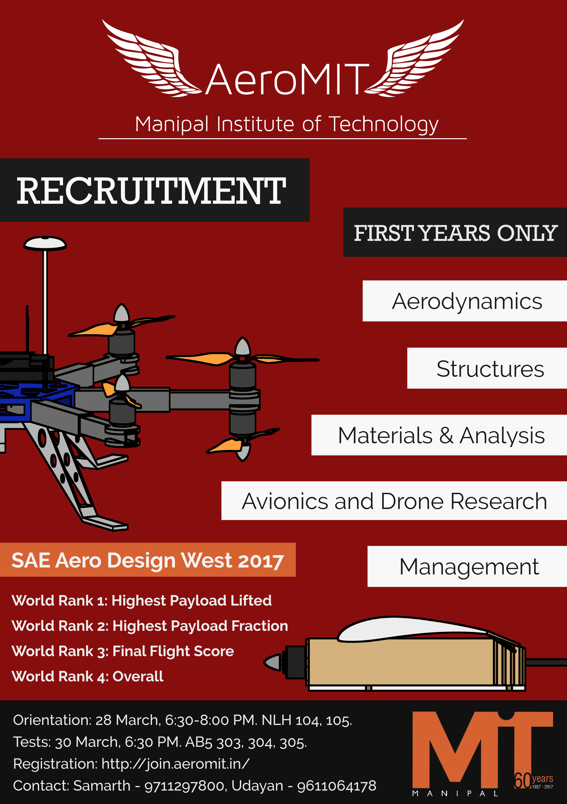
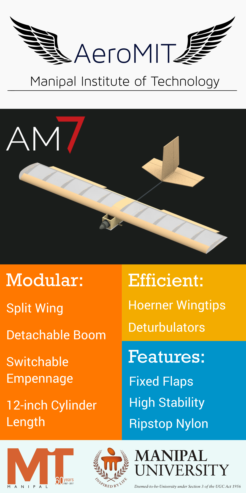
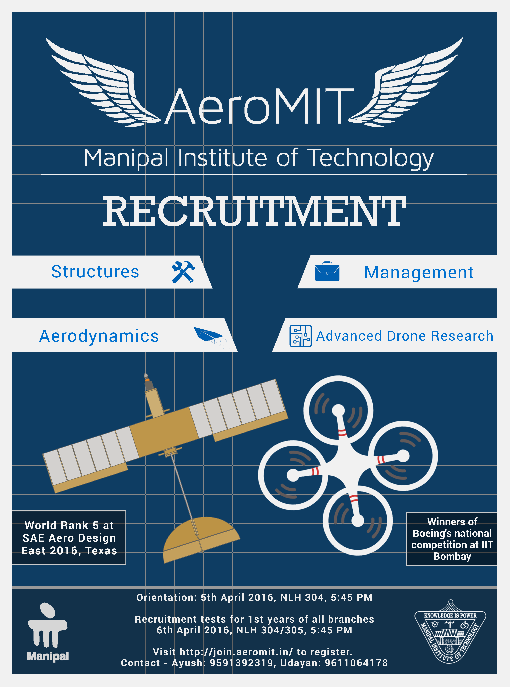
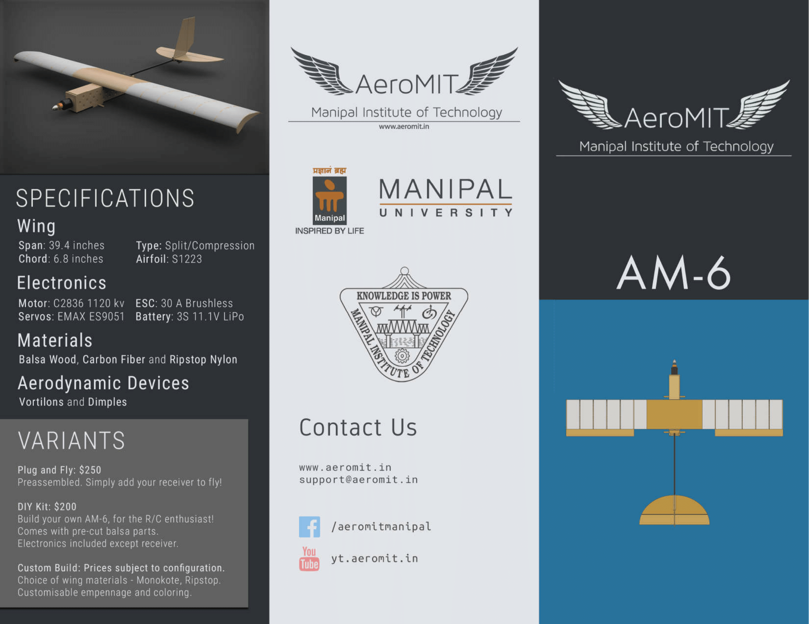
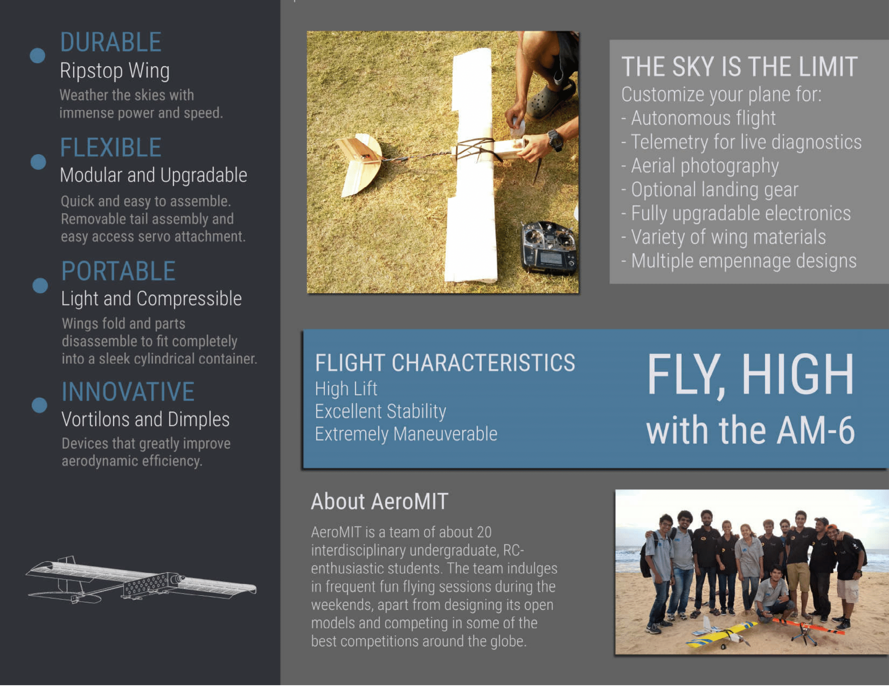

I never really saw myself ever getting involved in any kind of designing activities, as I don't feel I'm artistic enough or have the required `a e s t h e t i c` abilities. However, I was given the responsibility to design a couple of posters, presentations and brochures for my team AeroMIT, our university's aeromodelling team. I created a couple of items which I think are all right

>**Recruitment Poster 2017** 

>**AM-7 Aircraft Standee 2017**

>**Recruitment Poster 2016**

>**AM-6 Aircraft Brochure 2016**

