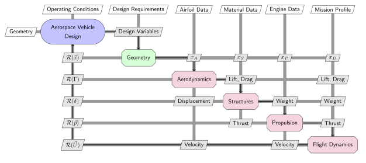
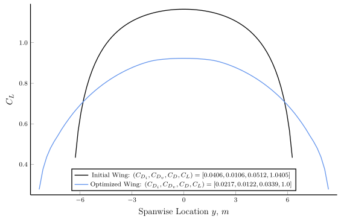
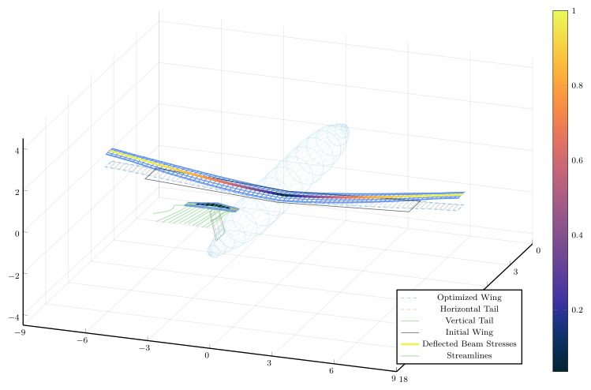

<!-- **A computational framework to teach aerospace engineering with multidisciplinary design optimization.** -->

This work is an interactive, computational platform for aircraft design designed to be used as an instructional tool: [AeroFuse](https://github.com/GodotMisogi/AeroFuse.jl).
* Used at The Hong Kong University of Science and Technology, and Imperial College London.
* Implemented geometry, aerodynamics (vortex-lattice), structures (beam-element), propulsion (blade-element momentum theory), and flight dynamics (rigid-body integrators) for coupled analyses.
* Enabled adjoint-based solutions of inverse and optimization problems between disciplines with automatic differentiation.

AeroFuse couples the disciplinary solvers into a single differentiable model, so complete aircraft configurations can be analyzed and optimized from one interface for conceptual and preliminary design.

<!--  -->

The platform is open source and documented for classroom use:

* Repository: [github.com/GodotMisogi/AeroFuse.jl](https://github.com/GodotMisogi/AeroFuse.jl)
* Documentation: [godotmisogi.github.io/AeroFuse.jl/stable](https://godotmisogi.github.io/AeroFuse.jl/stable/)

### Publications

* Arjit Seth, Stephane Redonnet, and Rhea P. Liem. "MADE: A Multidisciplinary Computational Framework for Aerospace Engineering Education". *IEEE Transactions on Education* 66.6 (2023), pp. 622–631. [doi:10.1109/TE.2023.3281825](https://doi.org/10.1109/TE.2023.3281825)
* Arjit Seth and Rhea Liem. *AeroMDAO — A Multidisciplinary Aircraft Design Platform for Education*. Teaching and Learning Symposium, Center for Education Innovation, HKUST, June 2022. [Talk](https://youtu.be/_H5ig2tr7S4)
