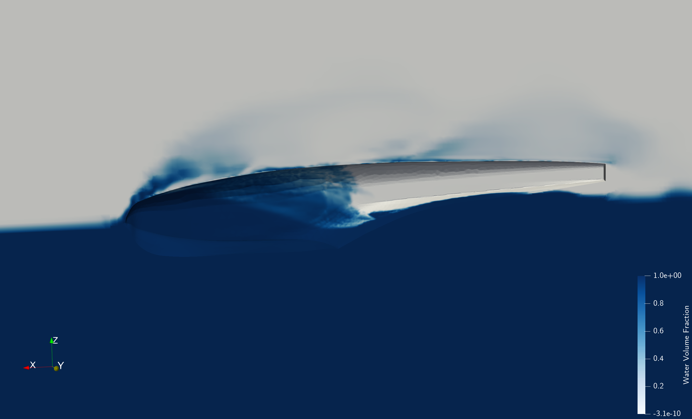
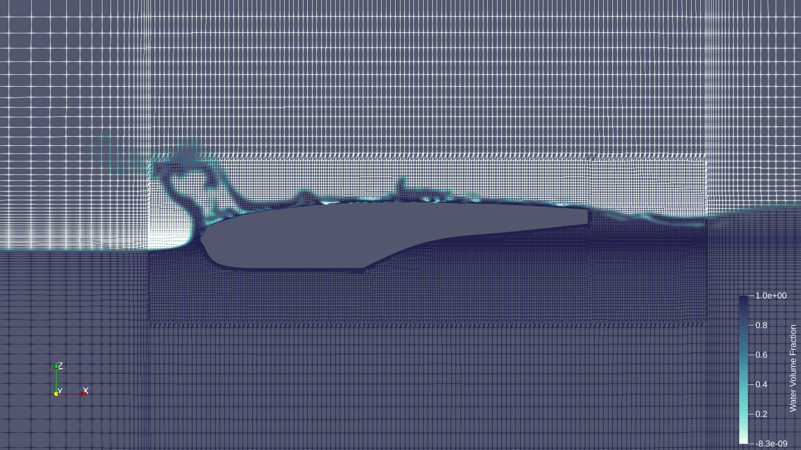
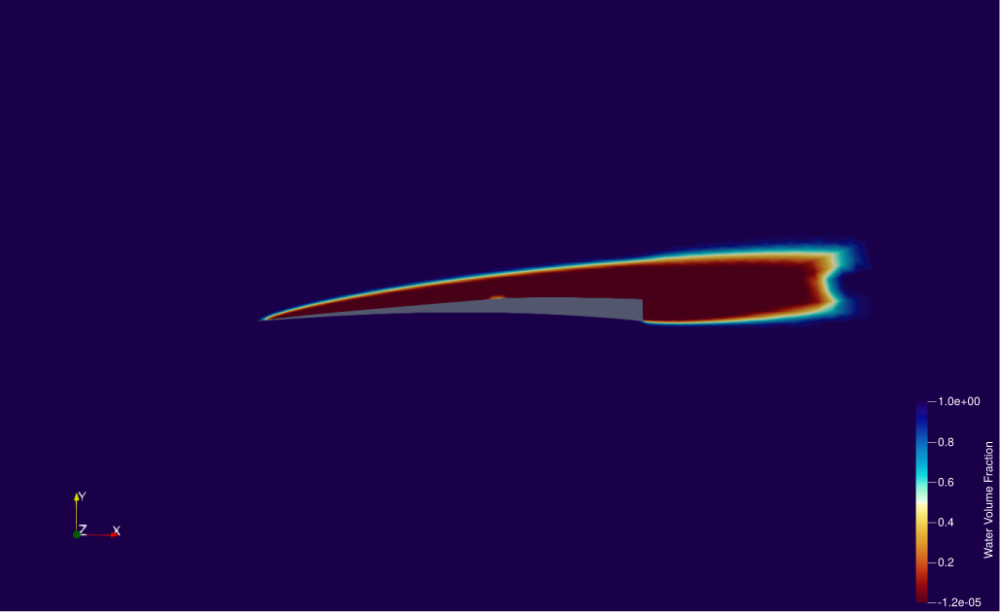
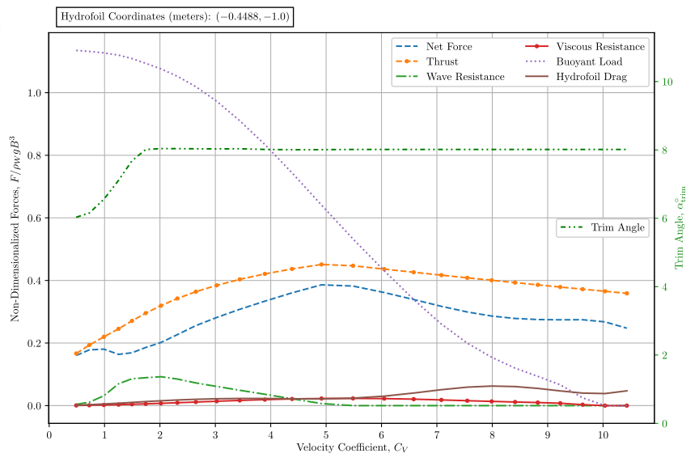

This work involved performing multiphase computational fluid dynamics (CFD) analyses of supercavitating hydrofoils and hulls to compute their hydrodynamic coefficients.

<!--  -->

The CFD sweeps were performed over speed and angle of attack to produce surrogate models for the hydrodynamic coefficients of a supercavitating hydrofoil, capturing the water volume fraction around the wetted section.

These surrogates were used in a water-takeoff analysis that coupled the hydrofoil, hull, and aircraft aerodynamic loads, over which the hydrofoil incidence and span were optimized to minimise takeoff distance.

### Publications

* Arjit Seth and Rhea Liem. "Hydrofoil Conceptual Design and Optimization Framework for Amphibious Aircraft". *AIAA AVIATION 2019 Forum*, Dallas, Texas, USA, 2019, p. 3552. [doi:10.2514/6.2019-3552](https://doi.org/10.2514/6.2019-3552)
* James M. Shihua, Arjit Seth, Ye Li, and Rhea P. Liem. "Experimental and Computational Analyses of Take-off Hydrodynamics of an Amphibian Aircraft Hull". *AIAA AVIATION 2020 Forum*, 2020, p. 3174. [doi:10.2514/6.2020-3174](https://doi.org/10.2514/6.2020-3174)
* Arjit Seth and Rhea P. Liem. "Amphibious Aircraft Developments: Computational Studies of Hydrofoil Design for Improvements in Water-Takeoffs". *Aerospace* 8.1 (2021), p. 10. [doi:10.3390/aerospace8010010](https://doi.org/10.3390/aerospace8010010)

This work formed the basis of my MPhil thesis, [*Development of a Computational Design Framework for Amphibious Aircraft*](https://repository.ust.hk/ir/Record/1783.1-109106).
