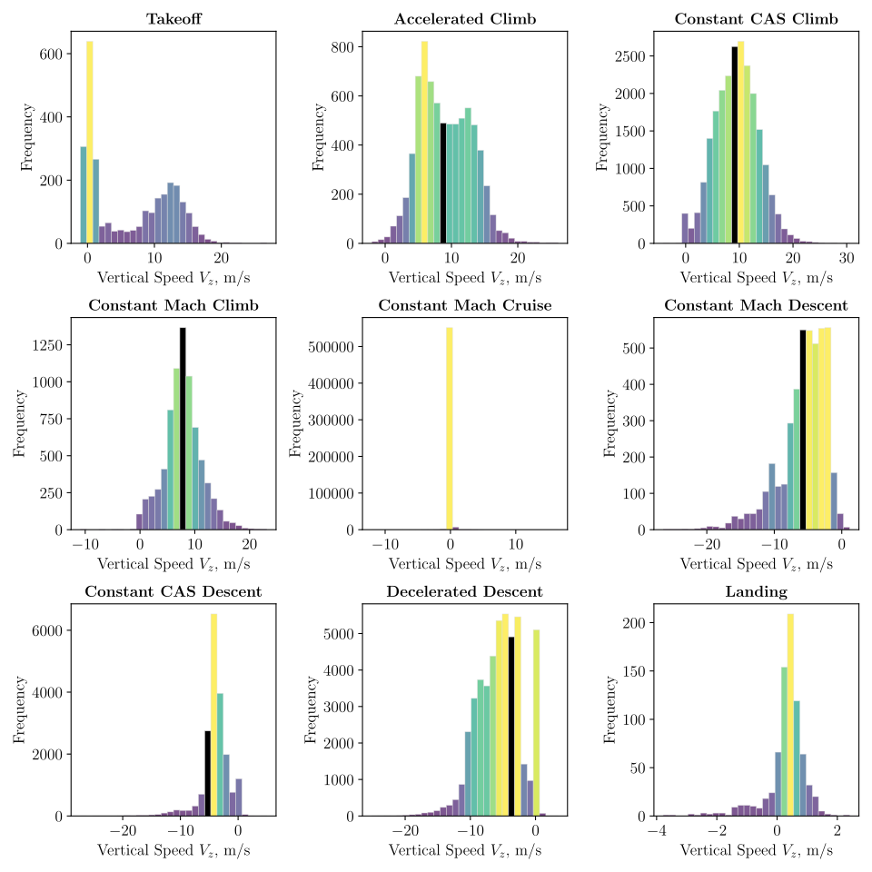
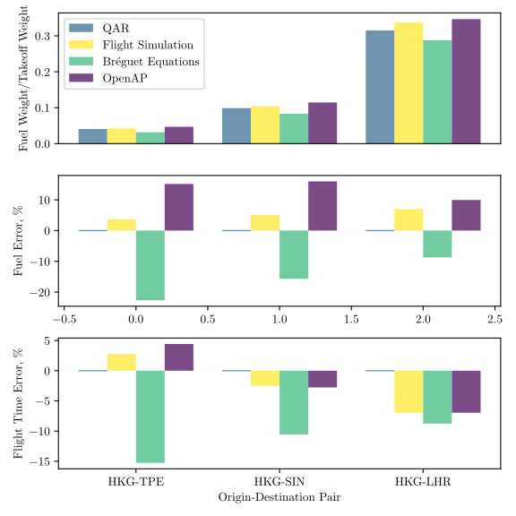

**Data-enhanced flight simulations *with machine learning* for performance analysis.**

* Derived nonlinear formulations for incorporating airline data into a flight simulation framework.
* Performed analyses of short, medium, and long-haul flights with *validation against airline data* from Cathay Pacific Airways.
* Prepared visualization and reporting tools for post-processing.

The framework simulates each flight phase — takeoff, climb, cruise, descent, and landing — and blends recorded Quick Access Recorder (QAR) data into the dynamics to correct fuel and time predictions against real operations.

Validated against regional flights out of Hong Kong (HKG–TPE, HKG–SIN, HKG–LHR), the method predicts fuel burn and flight time with single-digit percentage error.

### Publications

* Dajung Kim, Arjit Seth, and Rhea P. Liem. "Data-enhanced dynamic flight simulations for flight performance analysis". *Aerospace Science and Technology* 121 (2022), p. 107357. [doi:10.1016/j.ast.2022.107357](https://doi.org/10.1016/j.ast.2022.107357)
